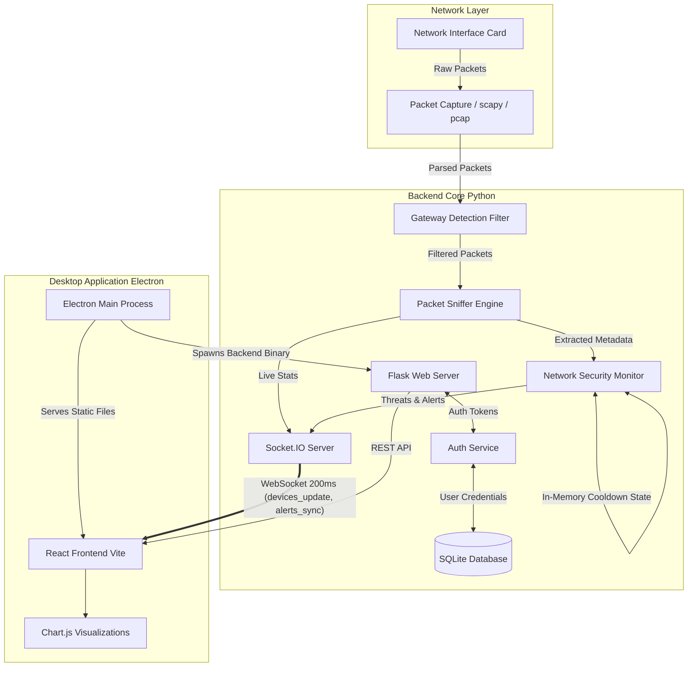
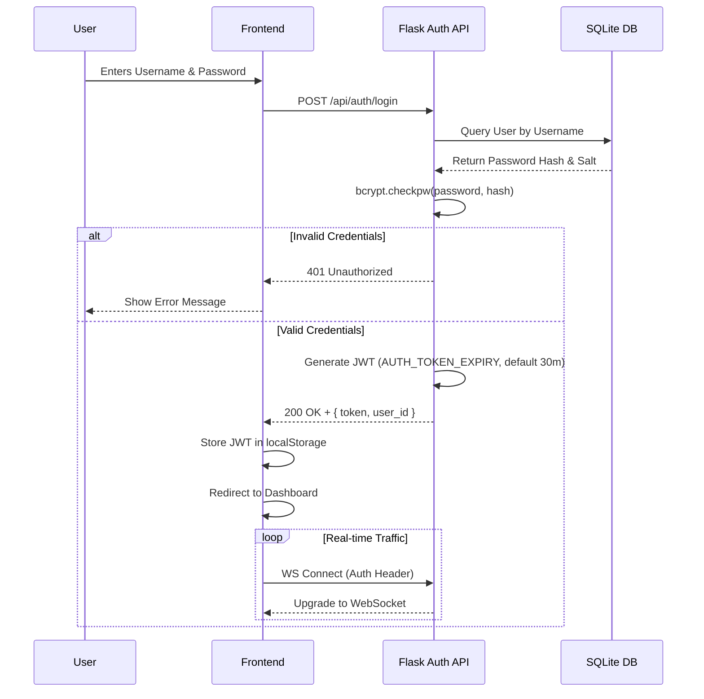
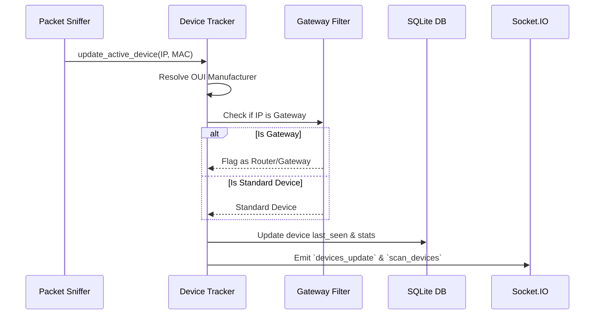

# Packet Peeper - System Architecture

This document provides a deep dive into the underlying architecture, data flow, and threat detection mechanisms of Packet Peeper.

## System Architecture

Packet Peeper is built on a decoupled architecture, separating the high-performance packet capture backend from the dynamic React frontend. They communicate in real-time via Socket.IO.

## Packet Processing Pipeline

The following sequence details how a single raw packet is ingested, parsed, classified, and analyzed for security threats in under a millisecond.

```mermaid
sequenceDiagram
    participant NIC as Network Interface
    participant Scapy as Packet Sniffer (Scapy)
    participant Classifier as Service Classifier
    participant NSM as Security Monitor
    participant SIO as Socket.IO
    participant Client as Frontend Dashboard

    NIC->>Scapy: Receive raw packet bytes
    Scapy->>Scapy: Decode L2/L3 (Ethernet/IP)
    Scapy->>Scapy: Decode L4 (TCP/UDP/ICMP)
    
    rect rgb(30, 41, 59)
        Note right of Scapy: Classification Phase
        Scapy->>Classifier: Extract IP/Port/Payload
        alt is DNS Packet
            Classifier->>Classifier: Cache DNS A/AAAA Records
        else is HTTPS (TLS)
            Classifier->>Classifier: Extract SNI Hostname
        else is Standard Traffic
            Classifier->>Classifier: Check IP against known CIDR blocks
        end
    end
    
    rect rgb(49, 14, 24)
        Note right of Classifier: Security Analysis Phase
        Classifier->>NSM: Send packet metadata
        NSM->>NSM: Update stateful connection tracking
        NSM->>NSM: Check Port Scan thresholds
        NSM->>NSM: Check DDoS thresholds
        NSM->>NSM: Check Brute Force (SSH/RDP/Telnet)
        NSM->>NSM: Check Session Hijacking & Beaconing
        NSM->>NSM: Check DNS Tunneling & Exfiltration
    end
    
    alt Threat Detected
        NSM->>NSM: Verify Cooldown Period
        NSM->>SIO: Generate Alert (High/Critical)
        SIO-->>Client: Emit `new_alert` event
    end

    Scapy->>SIO: Aggregate packet stats
    SIO-->>Client: Emit `new_packet` & `traffic_update` (batched 200ms)
```

## Authentication Workflow

With the introduction of the Local Authentication system, the desktop application now requires users to authenticate before viewing sensitive network traffic.

## Device Detection Pipeline

This sequence shows how devices are dynamically identified and filtered.

